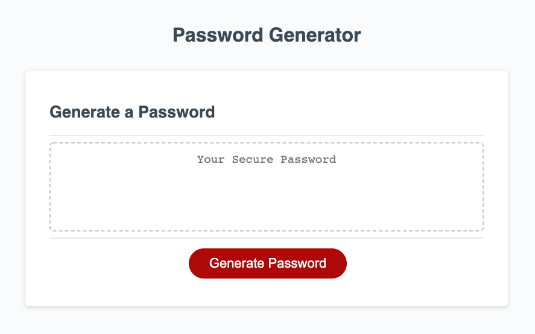

# PASSWORD GENERATOR
=========================================================================

## TABLE OF CONTENTS
--------------------

* Introduction
* User Instructions
* Technologies used
* Updates
* Maintainers

## INTRODUCTION
---------------

Password generator is JavaScript-heavy project with the main goal of producing secure and unique passwords for the user.

## USER INSTRUCTIONS
--------------------

1. Click "Generate Password" button.
2. Answer window prompts
3. Copy generated password to clipboard
4. Refresh screen to start the process over

**View the application, here:** [Password Generator](https://grohtech.github.io/horiseon/ "Password Generator")

**View website screenshots, here:**  

 
 
 
 
 
 
 

## TECHNOLOGIES USED
--------------------

* HTML
* CSS
* JavaScript

## UPDATES
----------

* **09.12.21 - Release Date**
    * Created functions
    * Added window prompts/alerts/confirms 
    * Added JS comments
    * Organized file structure

## MAINTAINERS
--------------

**Current maintainers**
1. Lauren Groh - [GitHub](https://github.com/GrohTech "GitHub Profile")